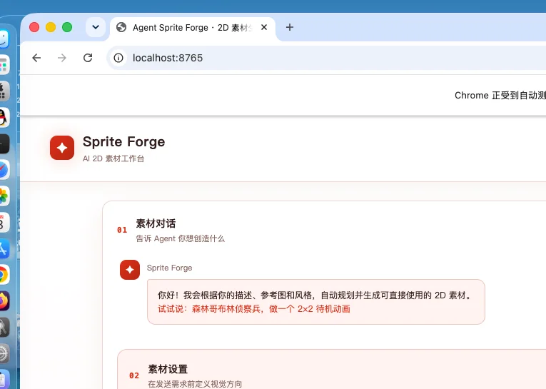

# Agent Sprite Forge

🎮 AI驱动的2D游戏资源生成平台 - 精灵图、特效和地图场景一站式解决方案

## 特性

### 核心功能
- **智能精灵生成**：怪物/生物、玩家角色、NPC、技能特效等游戏资源
- **动画序列帧**：待机、行走、攻击、施法、受击等完整动作集（支持4-128帧）
- **地图场景生成**：2D游戏环境和场景渲染
- **128+ 预设画风**：像素艺术、赛璐璐、水彩、赛博朋克、奇幻等多种游戏美术风格
- **AI辅助工作流**：Gemini 3.7驱动的提示词优化、安全审核和错误恢复

### 技术亮点
- **多阶段生成流水线**：提示词润色 → 模板应用 → 安全审核 → 图像生成 → 质量检查 → 自动切帧
- **质量控制系统**：自动检测帧一致性、锚点对齐、缩放变异，不合格自动重试
- **参考图支持**：上传最多14张参考图辅助生成（支持40MB总量）
- **批量导出**：自动打包生成资源、原图、元数据为ZIP
- **任务持久化**：SQLite数据库存储生成历史和状态

## 主界面预览



*128+种预设画风、自定义上传、多种生成模式*

## 快速开始

### 环境要求

- Python 3.10+
- 依赖包：FastAPI, Pillow, httpx, uvicorn等（见 `requirements.txt`）
- **AI后端**：需配置 `imagegen.py` 中的图像生成服务（默认使用内部API）

### 安装

```bash
# 克隆仓库
git clone https://github.com/q760440238/agent-sprite-forge.git
cd agent-sprite-forge

# 创建虚拟环境（推荐）
python -m venv .venv
source .venv/bin/activate  # Windows: .venv\Scripts\activate

# 安装依赖
pip install -r requirements.txt
```

### 配置

项目依赖以下模块（需要根据实际环境配置）：
- `webui/imagegen.py`：图像生成接口（Gemini提示词优化 + 图像生成API）
- `skills/generate2dsprite/`：精灵处理脚本（切帧、对齐、质量检查）

### 启动服务

```bash
# 启动WebUI服务器
python webui/server.py

# 默认访问地址：http://localhost:8765
```

服务启动后会自动：
- 初始化SQLite数据库（`sprite_forge.sqlite3`）
- 创建输出目录（`demo_out/`）
- 挂载静态文件服务

## 使用说明

### 生成精灵图

1. **选择资源类型**：sprite（精灵/特效）或 map（地图场景）
2. **选择对象类别**：creature（生物）、player（玩家）、npc（NPC）、asset（特效）
3. **选择动作模式**：
   - 静态：`single`（单帧静态图）
   - 动画：`idle`（待机）、`walk`（行走）、`attack`（攻击）、`cast`（施法）等
4. **选择画风**：从128+种预设中选择（见下方画风分类）
5. **输入描述**：用自然语言描述要生成的内容（最多800字符）
6. **设置参数**：
   - 画幅：1024x1024、1536x1536等
   - 帧数：4/8/16/24/32/64/128帧（部分模式固定帧数）
   - 可选：上传参考图（支持PNG/JPEG/WebP）
7. **生成并下载**：实时查看生成日志，完成后下载ZIP包

### 生成地图场景

1. 选择 `kind=map`
2. 输入场景描述（如"森林神社"、"赛博朋克运河"）
3. 选择画风和画幅
4. 生成完成后获得完整渲染的2D场景图

## 画风分类

项目内置**128种**预设画风，分为以下类别：

### 像素艺术
`retro_8bit`, `retro_16bit`, `retro_gameboy`, `neo_geo`, `snes_rpg`, `pixel_isometric`, `cyberpunk_pixel`, `dark_fantasy_pixel`, `cozy_pixel`, `noir_pixel`, `tactical_pixel`

### 游戏风格致敬
`pokemon`, `stardew_valley`, `hollow_knight`, `celeste`, `dead_cells`, `terraria`, `dont_starve`, `hades`, `ori`, `isaac`, `cuphead`, `shovel_knight`, `undertale`, `rayman`, `bastion`, `metroidvania`, `minecraft`

### 手绘/艺术风格
`watercolor_fantasy`, `gouache_storybook`, `oil_painted`, `ink_wash`, `sketch_draft`, `comic_ink`, `graphic_novel`, `woodblock_print`, `paper_cutout`, `stained_glass`, `art_nouveau`, `art_deco`

### 现代游戏风
`clean_mobile`, `handheld_rpg`, `hand_painted_rpg`, `flat_vector`, `low_poly_illustration`, `cute_chibi`, `anime_cel`, `anime_painterly`

### 主题风格
- **奇幻/魔法**：`gothic_fantasy`, `crystal_fantasy`, `dark_fantasy_pixel`
- **科幻**：`sci_fi_mecha`, `cyberpunk_pixel`, `realistic_sci_fi`
- **蒸汽/柴油朋克**：`steampunk`, `dieselpunk`
- **恐怖**（22种）：`horror_silent_hill`, `horror_resident_evil`, `horror_bloodborne`, `horror_dead_space`, `horror_fnaf`, `horror_little_nightmares`, `horror_limbo`等

### 写实风格
`realistic_fantasy`, `realistic_medieval`, `realistic_cyberpunk`, `realistic_post_apoc`, `realistic_ancient_egypt`, `realistic_three_kingdoms`, `realistic_samurai_era`, `realistic_knight`, `realistic_archer`, `realistic_mage`, `realistic_warrior`等（50+种）

### 其他特色
`arcade_32bit`, `bio_organic`, `tribal_ethnic`, `retro_poster`

完整画风列表见 [`webui/catalog.py`](webui/catalog.py)，每种画风包含：
- 唯一ID和显示名称
- 视觉描述和提示词
- 预览图（`webui/static/style_previews/`目录）

## 技术架构

### 前端
- **框架**：原生HTML/CSS/JavaScript（无构建依赖）
- **状态管理**：LocalStorage持久化
- **实时通信**：Server-Sent Events (SSE) 流式日志

### 后端
- **Web框架**：FastAPI（异步ASGI）
- **数据库**：SQLite3（WAL模式）
- **图像处理**：Pillow
- **并发控制**：asyncio + 信号量（最多2个并发任务）

### AI流水线
1. **提示词润色**：Gemini 3.7优化用户输入
2. **模板应用**：套用skill提示词模板（精灵图使用 `generate2dsprite` skill）
3. **安全审核**：Gemini审核最终提示词
4. **图像生成**：调用 `imagegen.generate()`（最多2次重试）
5. **质量检查**（仅精灵图）：
   - 自动切帧和锚点对齐
   - 检测体型缩放变异（`body_scale_cv`）
   - 检测锚点Y轴偏移（`anchor_y_std`）
   - QC失败自动调整提示词重试（最多2次）
6. **打包导出**：生成ZIP bundle（包含切分帧、原图、元数据）

### 项目结构

```
agent-sprite-forge/
├── webui/
│   ├── server.py              # FastAPI服务器主逻辑
│   ├── imagegen.py            # 图像生成和Gemini接口
│   ├── catalog.py             # 128种画风配置
│   └── static/
│       ├── index.html         # WebUI主界面
│       ├── app.js             # 前端逻辑
│       ├── app.css            # 样式
│       └── style_previews/    # 画风预览图（123张WebP，7.8MB）
├── skills/
│   ├── generate2dsprite/      # 精灵图生成Skill
│   │   ├── scripts/generate2dsprite.py  # 切帧和质检脚本
│   │   └── references/        # 提示词模板和规则
│   ├── generate2dmap/         # 地图生成Skill
│   └── video2dsprite/         # 视频转精灵Skill
├── tests/                     # 单元测试
├── deploy/                    # 部署配置（Nginx + systemd）
├── docs/                      # 文档和截图
├── requirements.txt           # Python依赖
└── README.md
```

## API接口

### 生成任务
```bash
POST /api/generate
Content-Type: multipart/form-data

参数:
- kind: "sprite" | "map"
- target: "creature" | "player" | "npc" | "asset"  # 仅sprite
- mode: "single" | "idle" | "walk" | "attack" ...  # 仅sprite
- brief: 需求描述（必填，最多800字符）
- style: 画风ID（默认：pixel_classic）
- style_note: 画风补充说明（可选，最多300字符）
- size: "1024x1024" | "1536x1536" | ...
- frame_count: 4/8/16/24/32/64/128  # 仅sprite，部分模式固定
- role: NPC类型（merchant/guard/villager/quest_giver）  # 仅target=npc
- references[]: 参考图文件（可选，最多14张，总计40MB）

返回:
{
  "job": "1725369600-a1b2c3",
  "requested_size": "1024x1024",
  "size": "1536x1536"  # 实际生成尺寸（自动调整以满足帧网格）
}
```

### 实时日志流
```bash
GET /api/stream/{job}
Accept: text/event-stream

事件类型:
- log: 进度日志
- prompt: 最终使用的提示词
- raw: 原图URL
- done: 完成（附带文件列表和bundle下载链接）
- error: 失败
```

### 查询任务
```bash
GET /api/jobs/{job}

返回完整任务信息（状态、文件、错误等）
```

### 历史记录
```bash
GET /api/history?limit=24

返回最近的生成任务列表
```

## 注意事项

### 配置要求
- 项目依赖 `imagegen.py` 中的图像生成服务（需要配置API密钥和端点）
- `skills/generate2dsprite/scripts/` 下的Python脚本需要在 `PATH` 中可执行
- 建议使用虚拟环境避免依赖冲突

### 资源消耗
- 预览图目录压缩后约**7.8MB**（123张WebP，512x512）
- 生成任务并发限制：**2个**（可在 `server.py` 中调整 `MAX_ACTIVE_JOBS`）
- 数据库使用WAL模式，支持并发读写

### 限制
- 单张参考图最大**32MP**（3200万像素）
- 参考图总大小最大**40MB**
- 需求描述最多**800字符**
- 画风补充说明最多**300字符**

### 生成质量
- 高帧数人形精灵（≥6帧）自动启用严格QC（体型和锚点检查）
- QC失败时AI会自动调整提示词重试
- 地图生成不进行切帧处理，输出完整场景图

## 部署

项目提供了生产环境部署配置：
- `deploy/agent-sprite-forge.service`：systemd服务配置
- `deploy/nginx-agent-sprite-forge.conf`：Nginx反向代理配置

```bash
# 示例：使用systemd部署
sudo cp deploy/agent-sprite-forge.service /etc/systemd/system/
sudo systemctl daemon-reload
sudo systemctl enable agent-sprite-forge
sudo systemctl start agent-sprite-forge
```

## License

MIT License - 详见 [LICENSE](LICENSE)

## 贡献

欢迎提交Issue和Pull Request！

开发时运行测试：
```bash
pytest tests/
```

## 多语言文档

- [English](README.md)
- [简体中文](README.zh-CN.md)
- [繁體中文](README.zh-TW.md)
- [日本語](README.ja.md)
- [한국어](README.ko.md)

---

**Built with ❤️ for game developers**
