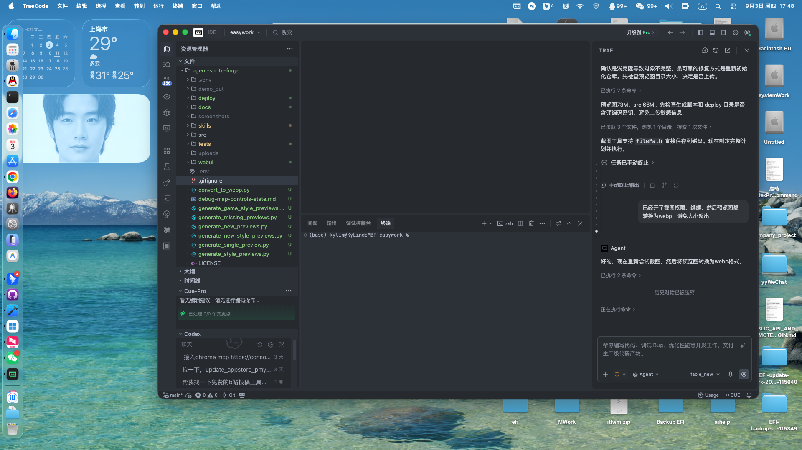

# Agent Sprite Forge

🎮 AI驱动的2D游戏精灵图生成平台，内置128+种视觉风格

## 特性

- **128+ 预设画风**：涵盖像素风、赛璐璐、水彩、赛博朋克、奇幻等多种游戏美术风格
- **自定义画风上传**：支持上传自定义Lora模型，扩展无限可能
- **多场景支持**：怪物/生物、玩家角色、NPC、技能特效等多种资源类型
- **动作模式丰富**：待机、行走、战斗、施法、受击等完整动作集
- **即用即生成**：Web界面操作，实时预览，一键导出

## 主界面



## 快速开始

### 环境要求

- Python 3.8+
- ComfyUI（需要单独安装和配置）
- 依赖包：见 `requirements.txt`

### 安装

```bash
# 克隆仓库
git clone https://github.com/q760440238/agent-sprite-forge.git
cd agent-sprite-forge

# 安装依赖（推荐使用虚拟环境）
pip install -r requirements.txt
```

### 启动服务

```bash
# 启动WebUI服务器
python webui/server.py

# 默认访问地址：http://localhost:8765
```

## 使用说明

1. **选择目标类型**：怪物、玩家角色、NPC或技能特效
2. **选择生成模式**：静态单体、待机循环、行走、战斗动作等
3. **选择画风**：从128+种预设画风中选择，或上传自定义Lora
4. **输入描述**：用自然语言描述要生成的精灵图
5. **生成并导出**：点击生成，等待AI创作，导出使用

## 画风分类

项目内置128+种画风，涵盖：

- **像素艺术**：经典像素、像素高清、赛博朋克像素、黑暗像素等
- **赛璐璐**：日系动画风、涂色风格
- **手绘风格**：水彩、素描、铅笔画、墨水画
- **现代游戏风**：手游风格、移动端、Roguelike风格
- **主题风格**：蒸汽朋克、赛博朋克、奇幻、科幻、恐怖等
- **经典游戏致敬**：像素塞尔达、空洞骑士、星露谷、饥荒等

完整画风列表见 `webui/catalog.py`

## 自定义画风

支持上传自定义Lora模型：

1. 点击"上传自定义画风"按钮
2. 填写画风名称和描述
3. 上传 `.safetensors` 格式的Lora文件
4. 自定义画风会持久化保存在浏览器中

## 技术架构

- **前端**：原生HTML/CSS/JavaScript，无框架依赖
- **后端**：FastAPI异步服务器
- **AI引擎**：基于ComfyUI workflow
- **存储**：LocalStorage本地持久化（自定义画风）

## 项目结构

```
agent-sprite-forge/
├── webui/
│   ├── server.py           # FastAPI服务器
│   ├── catalog.py          # 画风目录和配置
│   └── static/
│       ├── index.html      # 主界面
│       ├── app.js          # 前端逻辑
│       ├── app.css         # 样式
│       └── style_previews/ # 画风预览图（128张）
├── docs/                   # 文档和截图
└── README.md
```

## 注意事项

- 本项目依赖ComfyUI作为AI生成引擎，需要单独安装配置
- 预览图目录 `webui/static/style_previews/` 约73MB，已使用WebP格式压缩
- 自定义画风上传的Lora文件会存储到本地，请确保有足够磁盘空间
- 生成速度取决于硬件配置（GPU性能）

## License

MIT

## 贡献

欢迎提交Issue和Pull Request！

---

**Built with ❤️ for game developers**
